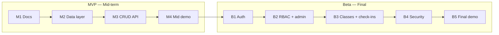

# Product Requirements Document (PRD) — Gym Buddy

| Field | Value |
|---|---|
| Product | Gym Buddy |
| Version | MVP + Beta |
| Releases | MVP — Mid-term, Beta — Final |
| Status | Draft |
| Related docs | [Software Requirements Specification (SRS)](02-srs.md), [Technical Design Document (TDD)](03-tdd.md) |

This document covers **both releases**. Every goal, feature and story has a **Release** column so it is clear what is built for the mid-term and what is added for the final.

**Documents in this set**

| Short form | Full form | Purpose | File |
|---|---|---|---|
| PRD | Product Requirements Document | What we build and why (this document) | [01-prd.md](01-prd.md) |
| SRS | Software Requirements Specification | Exact requirements, permissions and acceptance criteria | [02-srs.md](02-srs.md) |
| TDD | Technical Design Document | How we build it: architecture, data model, API | [03-tdd.md](03-tdd.md) |

## 0. Release plan

| Release | When | Focus |
|---|---|---|
| **MVP** | Mid-term | Core product: gym member CRUD REST API, database, deployed on Vercel |
| **Beta** | Final | Accounts and permissions (auth + RBAC), class bookings, check-ins, admin dashboard, security hardening |

## 1. Purpose

Gym Buddy is a simple gym management system built for a university course. Many small gyms still keep members in paper registers or spreadsheets, so nobody can quickly tell who has an expired membership, who came today, or whether a class is full. We build Gym Buddy in two clear steps:

1. **MVP (mid-term):** a small, working **REST API for creating, reading, updating and deleting gym members (CRUD)**, with plan and expiry tracking, deployed on Vercel.
2. **Beta (final):** turn the MVP into a multi-user product: member accounts and login, roles (RBAC), workout classes with bookings, attendance check-ins, an admin dashboard and security hardening.

## 2. Problem statement

Gym staff need one reliable place to keep member records, see who is still paying (valid membership) and who has expired, and record who comes in. Members want to check their own membership status and reserve a spot in a class without calling or visiting the front desk. A class has limited space, so the system must stop it from being over-booked. Member details such as phone numbers must stay private, and the system must be safe to run in production.

## 3. Goals

| ID | Goal | Release |
|---|---|---|
| G-1 | Provide a REST API for member CRUD that follows standard REST conventions. | MVP |
| G-2 | Store members in a database so data survives restarts and redeploys. | MVP |
| G-3 | Document the API automatically (OpenAPI at `/api/docs`). | MVP |
| G-4 | Deploy automatically to Vercel on every push to `main`. | MVP |
| G-5 | Each member has an account and sees only their own membership and check-in history. | Beta |
| G-6 | Control access with roles: `member` and `admin`. | Beta |
| G-7 | Let members book classes, with capacity limits that are never exceeded. | Beta |
| G-8 | Let staff record attendance and see gym usage on a dashboard. | Beta |
| G-9 | Protect accounts and data (hashed passwords, token security, login limits). | Beta |

## 4. Target users

| User | Need | Release |
|---|---|---|
| Gym staff / front desk | Add, view, edit, renew, freeze and delete member records, and filter by active, expired or frozen. | MVP |
| Frontend developer | A clear, documented API to build the UI on. | MVP |
| Instructor / reviewer | An easy way to try the API (`/api/docs`) and check the code. | MVP |
| Gym member | Log in, check my plan and expiry date, see my visits, browse and book classes, and manage my profile and password. | Beta |
| Admin (gym manager) | Manage members and classes, record check-ins, see who booked a class, manage users and roles, see usage stats on a dashboard, ban abusive accounts. | Beta |

In the **MVP** there are no accounts: staff use one shared member list. In the **Beta** members log in and see only their own data, while admins manage everything.

## 5. Scope

### In scope — MVP (mid-term)
- Create, list (with pagination and a status filter), view, update (including renew and freeze) and delete members
- Plans: `monthly`, `quarterly`, `yearly`, with start and expiry dates
- Input validation and clear error responses
- Health check endpoint
- Interactive API docs at `/api/docs`
- Automatic deploy to Vercel

### In scope — Beta (final)
- **Auth:** sign up, log in, log out, refresh session (JWT access token + refresh token)
- **User profile:** see my profile, change my name, change my password
- **Own membership:** a member sees their own membership record and check-in history; staff link a member record to an account
- **RBAC:** `member` and `admin` roles; admin manages members, classes, users and roles
- **Classes and bookings:** admins create, edit and delete classes (time, duration, capacity, optional trainer name); members browse classes, book a spot (valid membership required) and cancel; admins see who booked
- **Check-ins:** admins record when a member arrives (valid membership required) and view a member's check-in history
- **Admin dashboard:** usage stats (members, active and expired memberships, classes, check-ins, users) and ban / unban of abusive users
- **Security:** hashed passwords, secure cookies, login attempt limit, security headers, secrets only in env vars

### Out of scope for this semester
- Online payments, invoices and billing (staff renew by updating the expiry date)
- Automated test suite and CI/CD pipeline (GitHub Actions, branch protection) — planned for later
- Search and sorting beyond the status filter
- Trainer accounts and trainer schedules (the trainer is just a name on a class)
- Workout plans, diet plans, progress tracking, equipment tracking
- QR code or card-scanner check-in (staff record check-ins manually)
- Class waiting lists, recurring classes
- Reminders, notifications, SMS or email
- Email verification, password reset, social login, changing email

## 6. Features and priority (MoSCoW)

Priorities are per release: a Beta "Must" is required for the final, not for the mid-term.

| ID | Feature | Release | Priority |
|---|---|---|---|
| F-1 | Add member | MVP | Must |
| F-2 | List members (with status filter) | MVP | Must |
| F-3 | Get member by ID | MVP | Must |
| F-4 | Update member (details, renew, freeze / unfreeze) | MVP | Must |
| F-5 | Delete member | MVP | Must |
| F-6 | Validation and error responses | MVP | Must |
| F-7 | Health check | MVP | Must |
| F-8 | Pagination on list (`offset`, `limit`) | MVP | Should |
| F-9 | Simple React page that uses the API | MVP | Could |
| F-10 | Sign up, log in, log out, refresh session | Beta | Must |
| F-11 | Own membership and check-in history for members | Beta | Must |
| F-12 | Roles `member` / `admin` with permission checks | Beta | Must |
| F-13 | Admin-only member management and linking a member to an account | Beta | Must |
| F-14 | Classes: admin create / edit / delete, everyone can browse | Beta | Must |
| F-15 | Class bookings: book, cancel, capacity limit, admin sees bookings | Beta | Must |
| F-16 | Check-ins: admin records attendance and views history | Beta | Must |
| F-17 | Security hardening (hashing, cookies, login limit, headers) | Beta | Must |
| F-18 | React pages for login, my membership and classes | Beta | Could |
| F-19 | Admin dashboard: usage stats API + admin page | Beta | Should |
| F-20 | Ban / unban users (banned users cannot log in or use the API) | Beta | Must |
| F-21 | User profile: view profile, change name, change password | Beta | Should |

## 7. User stories

### MVP

| ID | Story | Feature |
|---|---|---|
| US-01 | As gym staff, I want to add a member with name, plan and expiry date, so the gym has a record of who joined. | F-1 |
| US-02 | As gym staff, I want to see all members and filter by active, expired or frozen, so I know who needs to renew. | F-2, F-8 |
| US-03 | As gym staff, I want to open one member, so I can see their details. | F-3 |
| US-04 | As gym staff, I want to edit a member's details and renew their membership by changing the expiry date, so records stay correct. | F-4 |
| US-05 | As gym staff, I want to freeze and unfreeze a membership, so a member can pause without being deleted. | F-4 |
| US-06 | As gym staff, I want to delete a member, so the list stays clean. | F-5 |
| US-07 | As a client developer, I want clear error messages, so I know what went wrong. | F-6 |
| US-08 | As a maintainer, I want a health endpoint, so I can check the deploy is running. | F-7 |

### Beta

| ID | Story | Feature |
|---|---|---|
| US-09 | As a visitor, I want to sign up with my email and a password, so I get my own account. | F-10 |
| US-10 | As a user, I want to log in and log out, so only I can use my account. | F-10 |
| US-11 | As a member, I want to see my own plan, expiry date and check-in history, so I know when to renew and how often I train. | F-11 |
| US-12 | As an admin, I want to list users and change their role, so I can manage who is an admin. | F-12 |
| US-13 | As an admin, I want to manage all member records and link a record to a member's account, so members can see their own data. | F-13 |
| US-14 | As an admin, I want to create, edit and delete classes with a time and a capacity, so members know what is offered. | F-14 |
| US-15 | As a member, I want to browse upcoming classes and see how many spots are taken, so I can pick one. | F-14 |
| US-16 | As a member, I want to book and cancel a class spot, so I do not need to call the front desk. | F-15 |
| US-17 | As an admin, I want to see who booked a class, so I can prepare for it. | F-15 |
| US-18 | As an admin, I want to record a member's check-in and see their visit history, so I can track attendance. | F-16 |
| US-19 | As a user, I want my password stored safely and repeated wrong logins blocked, so my account is hard to break into. | F-17 |
| US-20 | As an admin, I want a dashboard with stats (members, expired memberships, classes, check-ins), so I can see how the gym is used. | F-19 |
| US-21 | As an admin, I want to ban an abusive user with a reason, so they are logged out and cannot use the app. | F-20 |
| US-22 | As an admin, I want to unban a user, so I can restore access after a mistake or an appeal. | F-20 |
| US-23 | As a user, I want a profile page showing my name, email and role, so I can see my account details. | F-21 |
| US-24 | As a user, I want to change my name and my password, so I can keep my account up to date and secure. | F-21 |

## 8. Success metrics

### MVP
- All five CRUD endpoints work on the production Vercel URL.
- Filtering by `active`, `expired` and `frozen` returns the right members.
- Data is still there after a redeploy.
- `/api/docs` lists every endpoint with request and response schemas.

### Beta
- A member can never read another member's membership, phone number or check-ins.
- Every endpoint enforces the permission matrix in the [SRS, section 3.11](02-srs.md#311-permission-matrix--beta).
- A class is never booked beyond its capacity, even when two members book the last spot at the same time.
- Members with an expired or frozen membership cannot book classes or be checked in.
- Passwords are never stored or returned in plain text.
- A banned user is blocked on their very next request, not only at their next login.

## 9. Assumptions and constraints

- Hosted on Vercel (frontend and FastAPI backend in one project, see `vercel.json`).
- Vercel functions are serverless, so data must live in an external database (Supabase PostgreSQL), not a local file.
- Backend: Python 3.10+, FastAPI. Frontend: Vite + React + TypeScript.
- Payments happen outside the system; staff renew a membership by updating `expires_on`.
- "Today" for expiry checks is the server's UTC date.
- The first admin is promoted manually (role set in the Supabase table editor); after that admins manage roles through the API.
- MVP members are kept when the Beta is deployed; they become walk-in members until staff link them to an account.

## 10. Milestones

### MVP — Mid-term

| Milestone | Deliverable |
|---|---|
| M1 — Docs | [PRD](01-prd.md), [SRS](02-srs.md) and [TDD](03-tdd.md) (covering MVP and Beta) approved |
| M2 — Data layer | Member model and database connection |
| M3 — API | Five CRUD endpoints with validation and status filter |
| M4 — Mid demo | Live on Vercel, tagged `v0.1.0` (MVP) |

### Beta — Final

| Milestone | Deliverable |
|---|---|
| B1 — Auth | Sign up, login, logout, refresh, user profile (change name and password); members linked to accounts; Alembic migrations in place |
| B2 — RBAC + admin | `member` and `admin` roles, admin-only member endpoints, admin dashboard stats, ban / unban, permission checks on every endpoint |
| B3 — Classes + check-ins | Classes, bookings with capacity limit, check-ins and visit history |
| B4 — Security | Password hashing, secure cookies, login attempt limit, security headers, secret review |
| B5 — Final demo | Beta live on Vercel, tagged `v0.2.0` (Beta) |

## 11. Release dependencies

- The Beta is built on top of the MVP: the same `/api/v1/members` endpoints stay, but in the Beta they require an admin login, and members use `/api/v1/users/me/membership` to see their own record.
- Database migrations (Alembic) are introduced at the start of the Beta so the schema can grow from one table to six without manual SQL.
- Check-ins and bookings depend on the membership rules (valid, frozen, expired), so those rules are built and tested in the MVP first.