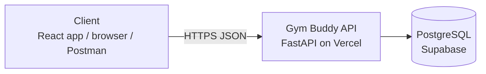
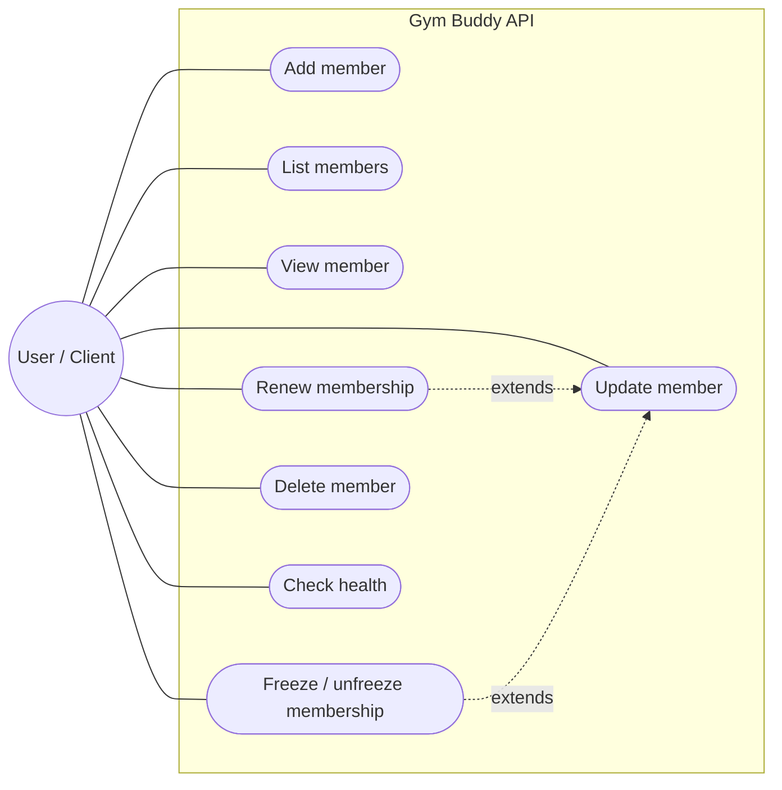
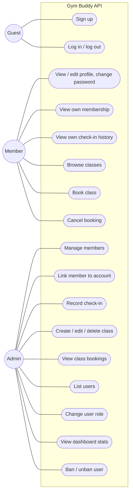
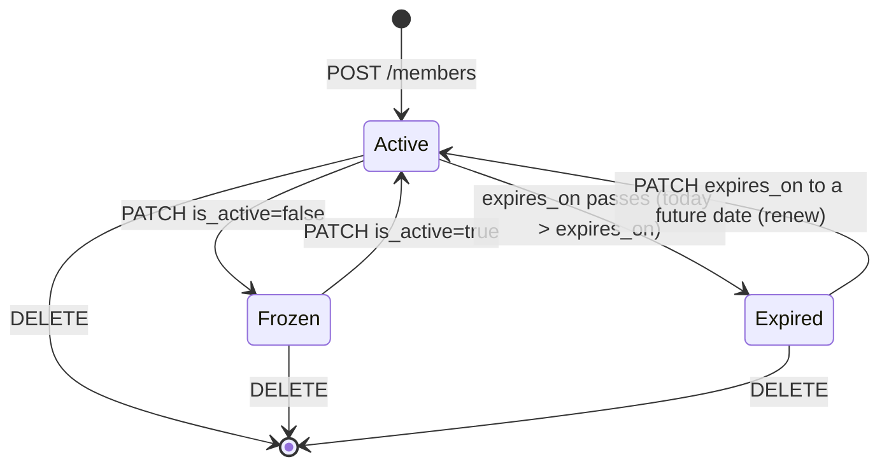

# Software Requirements Specification (SRS) — Gym Buddy

| Field | Value |
|---|---|
| Product | Gym Buddy |
| Version | MVP + Beta |
| Releases | MVP — Mid-term, Beta — Final |
| Status | Draft |
| Related docs | [Product Requirements Document (PRD)](01-prd.md), [Technical Design Document (TDD)](03-tdd.md) |

Every requirement has a **Release** column: **MVP** is built for the mid-term, **Beta** is added for the final.

**Documents in this set**

| Short form | Full form | Purpose | File |
|---|---|---|---|
| PRD | Product Requirements Document | What we build and why | [01-prd.md](01-prd.md) |
| SRS | Software Requirements Specification | Exact requirements, permissions and acceptance criteria (this document) | [02-srs.md](02-srs.md) |
| TDD | Technical Design Document | How we build it: architecture, data model, API | [03-tdd.md](03-tdd.md) |

## 1. Introduction

### 1.1 Purpose
This document lists the requirements for Gym Buddy: the MVP (gym member CRUD REST API) and the Beta (accounts, roles, class bookings, check-ins and security), deployed on Vercel.

### 1.2 Scope
- **MVP:** a client can create, list, view, update and delete gym members over HTTP. A member record holds name, phone, membership plan, start and expiry dates and an active flag. There are no accounts; all members are in one shared list.
- **Beta:** gym members sign up and log in, see their own membership and check-in history, and book workout classes. Admins (gym staff) manage members, classes, check-ins, users and roles.
- Out of scope: see [PRD, section 5](01-prd.md#5-scope). Online payments, billing and equipment tracking are not part of this system; staff record a renewal by changing the expiry date.

### 1.3 Definitions

| Term | Meaning |
|---|---|
| CRUD | Create, Read, Update, Delete |
| REST | API style where resources (like `members`) are accessed with HTTP methods (GET, POST, PATCH, DELETE) |
| Member | A person who has a gym membership record: name, phone, plan, dates and status |
| Plan | The membership type: `monthly`, `quarterly` or `yearly` |
| Valid membership | A membership with `is_active = true` and `expires_on` on or after today (UTC) |
| Frozen membership | A membership with `is_active = false` (paused by staff) |
| Expired membership | A membership with `expires_on` before today |
| Walk-in member | (Beta) A member record with no linked login account; staff manage it for them |
| Class | (Beta) A scheduled workout session with a name, start time, duration, capacity and optional trainer name |
| Booking | (Beta) A member's reserved spot in a class |
| Check-in | (Beta) A record that a member arrived at the gym, entered by staff |
| RBAC | Role-Based Access Control: what a caller can do depends on their role |
| JWT | JSON Web Token: a signed token that proves who the caller is |
| Access token | (Beta) Short-lived JWT sent in the `Authorization: Bearer` header |
| Refresh token | (Beta) Long-lived random token in an HttpOnly cookie, used to get a new access token |
| Client | Anything that calls the API: the React frontend, `/api/docs`, curl, Postman |
| OpenAPI | Standard API description; FastAPI generates it and shows it at `/api/docs` |

## 2. Overall description

### 2.1 System context

### 2.2 Users and roles

| Role | Release | Description |
|---|---|---|
| Anonymous client | MVP | Anyone who can reach the API; full access to the shared member list |
| Guest | Beta | Not logged in; can only sign up, log in, check health and read the API docs |
| Member | Beta | Logged in with global role `member`; views their own membership and check-ins, browses classes, books and cancels their own bookings |
| Admin | Beta | Gym staff with global role `admin`: manage all members, classes and check-ins, view bookings, view dashboard stats, list users, change roles, ban / unban users |

`member` and `admin` are **global** roles stored on the user account. A logged-in user is linked to at most one membership record (`member.user_id`). A logged-in `member` with no linked record can log in and edit their profile but gets `404` on membership and booking endpoints until staff link their account.

### 2.3 Use cases

**MVP**

**Beta**

Every Admin is also a logged-in user, so they can log out, edit their profile and change their password.

### 2.4 Constraints
- C-1: Runs on Vercel serverless functions (no local disk that survives between requests).
- C-2: Backend in Python 3.10+ with FastAPI.
- C-3: All API routes start with `/api`, because `vercel.json` sends `/api/*` to the backend.
- C-4: Requests and responses use JSON.
- C-5: Production database is Supabase PostgreSQL; local development uses SQLite.
- C-6: (Beta) Login is implemented in our own API (no third-party login providers).
- C-7: Dates (`joined_on`, `expires_on`) are plain calendar dates; "today" is the server's UTC date.

### 2.5 Assumptions
- A-1: A hosted database is available to the Vercel project through an environment variable.
- A-2: The app is used for demos and class work, so traffic is low.
- A-3: (Beta) The first admin is promoted manually in the Supabase table editor.
- A-4: (Beta) Existing MVP members are kept as walk-in members; staff link them to accounts later.
- A-5: Payments happen outside the system. Staff renew a membership by updating `expires_on`.

## 3. Functional requirements

### 3.1 Members — MVP

| ID | Requirement | Release | Story |
|---|---|---|---|
| FR-01 | The system shall create a member from a JSON body with `full_name`, `plan`, `expires_on` (required) and `phone`, `joined_on`, `notes` (optional). `joined_on` defaults to today. New members have `is_active = true`. | MVP | US-01 |
| FR-02 | The system shall return the list of members, newest first. The list can be filtered by `status`: `active` (valid), `expired` or `frozen`. | MVP | US-02 |
| FR-03 | The list shall support `offset` (default 0) and `limit` (default 20, max 100) query parameters. | MVP | US-02 |
| FR-04 | The system shall return one member by their ID. | MVP | US-03 |
| FR-05 | The system shall update any of `full_name`, `phone`, `plan`, `expires_on`, `is_active`, `notes` on an existing member. Fields not sent stay unchanged. Setting a later `expires_on` renews the membership; setting `is_active = false` freezes it. | MVP | US-04, US-05 |
| FR-06 | The system shall delete a member by their ID. | MVP | US-06 |
| FR-07 | The system shall set `created_at` when a member is created and update `updated_at` on every change. | MVP | US-04 |
| FR-08 | The system shall reject invalid input with status `422` and a message saying which field is wrong. This includes an `expires_on` earlier than `joined_on`. | MVP | US-07 |
| FR-09 | The system shall return `404` when a member ID does not exist. | MVP | US-07 |
| FR-10 | The system shall expose `GET /api/health` returning `{"status": "ok"}`. | MVP | US-08 |
| FR-11 | The system shall publish interactive API docs at `/api/docs`. | MVP | US-07 |

### 3.2 Authentication and profile — Beta

| ID | Requirement | Release | Story |
|---|---|---|---|
| FR-12 | The system shall let a guest sign up with `email`, `name` and `password`. Email is unique (case-insensitive); a duplicate returns `409`. New users get role `member`. Signing up does not create or link a membership record. | Beta | US-09 |
| FR-13 | The system shall log a user in with email and password, returning an access token in the body and setting a refresh token cookie. Wrong email or password returns `401` with the same message for both. | Beta | US-10 |
| FR-14 | The system shall issue a new access token when called with a valid refresh token cookie, and replace (rotate) the refresh token. | Beta | US-10 |
| FR-15 | The system shall log a user out by revoking the refresh token and clearing the cookie. | Beta | US-10 |
| FR-16 | The system shall return the logged-in user's profile (`id`, `email`, `name`, `role`). The password hash is never returned. | Beta | US-10 |
| FR-40 | A user shall be able to change their own `name`. Email and role cannot be changed through the profile. | Beta | US-23, US-24 |
| FR-41 | A user shall be able to change their password by sending the current and the new password. A wrong current password returns `400`. On success all the user's sessions (refresh tokens) are revoked and they log in again. | Beta | US-24 |

### 3.3 Own membership and check-ins — Beta

| ID | Requirement | Release | Story |
|---|---|---|---|
| FR-17 | A logged-in user shall be able to view their own membership record (plan, dates, status). If no membership is linked to their account, the response is `404`. | Beta | US-11 |
| FR-18 | A logged-in user shall be able to list their own check-in history (newest first, paginated). A user can never read another member's membership or check-ins through these endpoints. | Beta | US-11 |

### 3.4 Member management by admin — Beta

| ID | Requirement | Release | Story |
|---|---|---|---|
| FR-19 | In the Beta, the member endpoints (`/api/v1/members`) create, list, view, update and delete shall be available to admins only. A non-admin gets `403`. | Beta | US-13 |
| FR-23 | When creating or updating a member, an admin may set `user_id` to link the record to an existing account. A user can be linked to only one member (`409` otherwise); an unknown `user_id` returns `422`. | Beta | US-13 |

### 3.5 Roles (RBAC) and admin — Beta

| ID | Requirement | Release | Story |
|---|---|---|---|
| FR-20 | Every user shall have exactly one global role: `member` or `admin`. | Beta | US-12 |
| FR-21 | An admin shall be able to list all users (paginated). | Beta | US-12 |
| FR-22 | An admin shall be able to change another user's role. An admin cannot change their own role (`400`), so the system always keeps at least one admin. | Beta | US-12 |
| FR-24 | A non-admin calling an admin-only endpoint shall get `403`. | Beta | US-12, US-13 |
| FR-35 | An admin shall be able to view dashboard stats: total members, active members, expired members, new members in the last 7 days, total and upcoming classes, check-ins today and in the last 7 days, and total users, admins and banned users. | Beta | US-20 |
| FR-36 | An admin shall be able to ban a user with an optional reason. Banning revokes all the user's refresh tokens. An admin cannot ban themself or another admin (`400`); demote the admin first. | Beta | US-21 |
| FR-37 | A banned user shall get `403` ("Account banned") on login and on every authenticated request, even with an access token that has not expired yet. | Beta | US-21 |
| FR-38 | An admin shall be able to unban a user; the user can then log in again. The user's linked membership and bookings are kept while banned. | Beta | US-22 |
| FR-39 | The admin user list shall show each user's status (`active` / `banned`), ban date and ban reason. | Beta | US-21 |

### 3.6 Classes and bookings — Beta

| ID | Requirement | Release | Story |
|---|---|---|---|
| FR-25 | An admin shall be able to create a class with `name`, `starts_at`, `duration_minutes` and `capacity` (and optional `description`, `trainer_name`). | Beta | US-14 |
| FR-26 | Any logged-in user shall be able to list classes (optionally only upcoming, ordered by start time) and view one class. Each class shows `booked_count` and, for members, whether they booked it (`is_booked_by_me`). | Beta | US-15 |
| FR-27 | An admin shall be able to edit or delete a class. Lowering `capacity` below the current number of bookings returns `422`. Deleting a class deletes its bookings. | Beta | US-14 |
| FR-28 | An admin shall be able to list the bookings of a class (member name and booking time). | Beta | US-17 |
| FR-29 | A member with a valid membership shall be able to book a class that has not started yet, and cancel their own booking. Booking returns `400` if the membership is not valid or the class already started, `409` if the class is full or the member already booked it. A member can book or cancel only for themself. | Beta | US-16 |

### 3.7 Check-ins — Beta

| ID | Requirement | Release | Story |
|---|---|---|---|
| FR-30 | An admin shall be able to record a check-in for a member. The request returns `400` if the membership is not valid (frozen or expired). The check-in stores who recorded it and when. | Beta | US-18 |
| FR-31 | An admin shall be able to list a member's check-ins (newest first, paginated). | Beta | US-18 |
| FR-32 | Recording more than one check-in for the same member on the same day is allowed; each is stored as its own record. | Beta | US-18 |
| FR-33 | A user whose account has no linked membership shall get `404` for FR-17, FR-18 and FR-29. | Beta | US-11 |

### 3.8 Account security — Beta

| ID | Requirement | Release | Story |
|---|---|---|---|
| FR-34 | After 5 failed logins in a row for an email, the system shall block logins for that account for 15 minutes and return `429`. A successful login resets the counter. | Beta | US-19 |

### 3.9 Validation rules

| Field | Rule | Release |
|---|---|---|
| `full_name` | Required on create, string, 1–100 characters after trimming spaces | MVP |
| `phone` | Optional, string, max 20 characters | MVP |
| `plan` | Required on create, one of `monthly`, `quarterly`, `yearly` | MVP |
| `joined_on` | Optional, date in `YYYY-MM-DD` format, defaults to today | MVP |
| `expires_on` | Required on create, date in `YYYY-MM-DD` format, not earlier than `joined_on` | MVP |
| `is_active` | Boolean | MVP |
| `notes` | Optional, string, max 500 characters | MVP |
| `offset` | Integer ≥ 0 | MVP |
| `limit` | Integer 1–100 | MVP |
| `status` (filter) | `active`, `expired` or `frozen` | MVP |
| `email` | Valid email, max 254 characters, stored lowercase | Beta |
| `name` (user) | 1–100 characters | Beta |
| `password` | 8–128 characters | Beta |
| `role` | `member` or `admin` | Beta |
| `reason` (ban) | Optional, max 500 characters | Beta |
| `user_id` (member link) | Optional; must be an existing user not linked to another member | Beta |
| `name` (class) | 1–100 characters | Beta |
| `description` (class) | Optional, max 500 characters | Beta |
| `trainer_name` | Optional, max 100 characters | Beta |
| `starts_at` | Date and time (ISO 8601, stored in UTC) | Beta |
| `duration_minutes` | Integer 15–240 | Beta |
| `capacity` | Integer 1–200 | Beta |

### 3.10 Membership states

A new member always starts as `Active` if `expires_on` is today or later. "Expired" is calculated from the date, not stored, so nothing needs to run when a membership ends. A frozen membership is not valid even if its expiry date is in the future. Only an **Active** (valid) membership can book classes or be checked in.

### 3.11 Permission matrix — Beta

| Action | Guest | Member | Admin |
|---|---|---|---|
| Sign up, log in | Yes | — | — |
| Log out, view own profile, change own name and password | No | Yes | Yes |
| View own membership and check-in history | No | Yes (`404` if no membership linked) | Only if linked |
| Create, list, view, update, delete members | No | No (`403`) | Yes |
| Link a member record to a user account | No | No (`403`) | Yes |
| Record or list check-ins for a member | No | No (`403`) | Yes |
| List and view classes | No | Yes | Yes |
| Create, edit, delete classes | No | No (`403`) | Yes |
| View a class's bookings | No | No (`403`) | Yes |
| Book or cancel own class booking | No | Yes (valid membership needed to book) | Only if linked |
| List users, change roles | No | No (`403`) | Yes |
| View dashboard stats, ban / unban users | No | No (`403`) | Yes (not self, not other admins) |

Every endpoint except sign up, log in, refresh, health and the docs returns `401` when no valid token is sent.

### 3.12 Status codes

| Case | Code | Release |
|---|---|---|
| Resource created | `201 Created` | MVP |
| Read or update succeeded | `200 OK` | MVP |
| Deleted / logged out / booking cancelled | `204 No Content` | MVP |
| Validation failed | `422 Unprocessable Content` | MVP |
| Resource not found, or caller may not know it exists | `404 Not Found` | MVP |
| Unexpected server error | `500 Internal Server Error` | MVP |
| Bad request (e.g. membership not valid, class already started, admin changing own role) | `400 Bad Request` | Beta |
| Missing, invalid or expired token; wrong login | `401 Unauthorized` | Beta |
| Logged in but role not allowed, or account banned | `403 Forbidden` | Beta |
| Duplicate or full (email taken, already booked, class full, account already linked) | `409 Conflict` | Beta |
| Too many failed logins | `429 Too Many Requests` | Beta |

## 4. Non-functional requirements

| ID | Category | Requirement | Release |
|---|---|---|---|
| NFR-01 | Performance | 95% of member requests answer in under 500 ms (excluding a cold start). | MVP |
| NFR-02 | Persistence | Data is stored in a database and is not lost on redeploy or restart. | MVP |
| NFR-03 | Availability | The production API is reachable on the Vercel URL during the semester. | MVP |
| NFR-04 | Security | All traffic uses HTTPS (provided by Vercel). | MVP |
| NFR-05 | Security | Database credentials and secrets are stored only in Vercel environment variables, never in Git. | MVP |
| NFR-06 | Security | Database queries use the ORM with parameters, never string-built SQL. | MVP |
| NFR-07 | Security | Error responses do not expose stack traces or database details. | MVP |
| NFR-08 | Maintainability | Code is split into layers: routes, schemas, models, database. | MVP |
| NFR-09 | Usability (API) | Every endpoint is listed in `/api/docs` with request and response schemas. | MVP |
| NFR-10 | Deployability | The app runs on Vercel; a push to `main` updates production. | MVP |
| NFR-11 | Security | Passwords are hashed with Argon2; plain passwords are never stored, logged or returned. | Beta |
| NFR-12 | Security | Access tokens are JWTs signed with a secret of at least 32 bytes from an env var, valid for 15 minutes. | Beta |
| NFR-13 | Security | Refresh tokens are random, valid for 7 days, stored only as a hash, and replaced on every refresh. | Beta |
| NFR-14 | Security | The refresh token cookie is `HttpOnly`, `Secure`, `SameSite=Strict` and limited to path `/api/v1/auth`. | Beta |
| NFR-15 | Security | Frontend and API share one origin, so CORS stays disabled (no cross-origin access). | Beta |
| NFR-16 | Security | Responses include security headers: `X-Content-Type-Options`, `X-Frame-Options`, `Referrer-Policy`, `Strict-Transport-Security`. | Beta |
| NFR-17 | Security | Every permission check runs on the server for every request; the frontend hiding a button is never the only protection. | Beta |
| NFR-18 | Performance | Sign up and login answer in under 1 s (password hashing is slow on purpose). | Beta |
| NFR-19 | Maintainability | Database schema changes are made through Alembic migrations, not by hand. | Beta |
| NFR-20 | Privacy | Member phone numbers and notes are returned only to admins and to the member themself. | Beta |
| NFR-21 | Consistency | Booking a class checks capacity and inserts the booking in one database transaction, so a class is never over capacity and a member never books the same class twice. | Beta |

## 5. Acceptance criteria

### MVP

**AC-01 Add member (FR-01, FR-07)**
- Given a valid body `{"full_name": "Rafi Ahmed", "plan": "monthly", "expires_on": "2026-11-10"}`
- When the client sends `POST /api/v1/members`
- Then the response is `201` with an `id`, `is_active: true`, `joined_on` set to today, and `created_at` set.

**AC-02 Add member with invalid data (FR-08)**
- Given a body `{}`, or `{"full_name": "", ...}`, or `"plan": "weekly"`, or `expires_on` earlier than `joined_on`
- When the client sends `POST /api/v1/members`
- Then the response is `422` and mentions the wrong field.

**AC-03 List members (FR-02, FR-03)**
- Given 25 members exist
- When the client sends `GET /api/v1/members?limit=10&offset=0`
- Then the response is `200` with 10 members, newest first.
- When the client sends `GET /api/v1/members?status=expired`, only members with `expires_on` before today are returned.

**AC-04 Get member (FR-04, FR-09)**
- Given member `5` exists
- When the client sends `GET /api/v1/members/5`, the response is `200` with that member.
- When the client sends `GET /api/v1/members/9999`, the response is `404`.

**AC-05 Renew membership (FR-05, FR-07)**
- Given member `5` has `expires_on: 2026-10-01`
- When the client sends `PATCH /api/v1/members/5` with `{"expires_on": "2026-12-01"}`
- Then the response is `200`, `expires_on` is `2026-12-01`, the name is unchanged, and `updated_at` is newer.

**AC-06 Freeze membership (FR-05)**
- Given member `5` is active
- When the client sends `PATCH /api/v1/members/5` with `{"is_active": false}`
- Then the response is `200` with `is_active: false`, and `GET /api/v1/members?status=frozen` includes member `5`.

**AC-07 Delete member (FR-06, FR-09)**
- Given member `5` exists
- When the client sends `DELETE /api/v1/members/5`
- Then the response is `204`, and a following `GET /api/v1/members/5` returns `404`.

**AC-08 Health (FR-10)**
- When the client sends `GET /api/health`
- Then the response is `200` with `{"status": "ok"}`.

### Beta

**AC-09 Sign up (FR-12)**
- Given no account exists for `a@x.com`
- When a guest signs up with that email, the response is `201` with role `member` and no password field.
- When anyone signs up again with `A@x.com`, the response is `409`.

**AC-10 Log in (FR-13)**
- Given user `a@x.com` exists
- When they log in with the right password, the response is `200` with an `access_token`, and a `refresh_token` cookie is set.
- When they log in with a wrong password, the response is `401`.

**AC-11 Token required (FR-24)**
- When a client calls `GET /api/v1/users/me` or `GET /api/v1/classes` without a token, or with an expired one
- Then the response is `401`.

**AC-12 Own membership only (FR-17, FR-18, FR-33)**
- Given user A is linked to member `5` and user B is linked to member `6`
- When A sends `GET /api/v1/users/me/membership`, the response is `200` with member `5`.
- When A sends `GET /api/v1/members/6`, the response is `403`.
- Given user C has no linked membership, when C sends `GET /api/v1/users/me/membership`, the response is `404`.

**AC-13 Admin only members (FR-19, FR-24)**
- When a `member` calls `POST /api/v1/members` or `GET /api/v1/members`, the response is `403`.
- When an `admin` calls them, the response is `201` or `200`.

**AC-14 Link account to member (FR-23)**
- Given member `5` has no account and user A exists
- When an admin sends `PATCH /api/v1/members/5` with `{"user_id": <A's id>}`, the response is `200`.
- When an admin links the same user to member `6`, the response is `409`.

**AC-15 Create class (FR-25, FR-26)**
- When an admin creates class "Morning Yoga" with `capacity: 2`
- Then the response is `201`, and the class appears in `GET /api/v1/classes?upcoming=true` with `booked_count: 0`.
- When a `member` sends `POST /api/v1/classes`, the response is `403`.

**AC-16 Book class (FR-29, NFR-21)**
- Given member A has a valid membership and class `3` is upcoming with free spots
- When A sends `POST /api/v1/classes/3/bookings`, the response is `201` and `booked_count` goes up by 1.
- When A books the same class again, the response is `409`.

**AC-17 Class full (FR-29)**
- Given class `3` has `capacity: 2` and 2 bookings
- When another valid member sends `POST /api/v1/classes/3/bookings`
- Then the response is `409` and no booking is created.

**AC-18 Booking needs a valid membership (FR-29)**
- Given member B's membership is expired or frozen
- When B sends `POST /api/v1/classes/3/bookings`
- Then the response is `400`.
- When the class has already started, the response is `400` for a valid member too.

**AC-19 Cancel booking (FR-29)**
- Given member A booked class `3`
- When A sends `DELETE /api/v1/classes/3/bookings`
- Then the response is `204` and the spot is free again.
- When A sends it again, the response is `404`.

**AC-20 Lower capacity (FR-27)**
- Given class `3` has 2 bookings
- When an admin sends `PATCH /api/v1/classes/3` with `{"capacity": 1}`
- Then the response is `422`.

**AC-21 View bookings (FR-28)**
- When an admin sends `GET /api/v1/classes/3/bookings`, the response is `200` with the booked members.
- When a `member` sends it, the response is `403`.

**AC-22 Record check-in (FR-30, FR-31, FR-32)**
- Given member `5` has a valid membership
- When an admin sends `POST /api/v1/members/5/check-ins`, the response is `201` with `checked_in_at`.
- When the admin records a second check-in the same day, the response is `201` again.
- Given member `6` is expired, `POST /api/v1/members/6/check-ins` returns `400`.
- Member `5`'s owner sees both check-ins in `GET /api/v1/users/me/check-ins`, newest first.

**AC-23 Change role (FR-22)**
- When an admin sets user B's role to `admin`, the response is `200` and B can now call admin endpoints.
- When an admin tries to change their own role, the response is `400`.

**AC-24 Login lockout (FR-34)**
- Given 5 failed logins in a row for `a@x.com`
- When the right password is sent within 15 minutes
- Then the response is `429`; after 15 minutes the login succeeds.

**AC-25 Dashboard stats (FR-35)**
- Given 30 members (20 valid, 8 expired, 2 frozen), 6 classes (2 upcoming), 12 check-ins today, 10 users (1 banned)
- When an admin sends `GET /api/v1/admin/stats`
- Then the response is `200` with `members.total = 30`, `members.active = 20`, `members.expired = 8`, `classes.upcoming = 2`, `check_ins.today = 12`, `users.banned = 1`.
- When a `member` sends it, the response is `403`.

**AC-26 Ban user (FR-36, FR-37)**
- Given user B is logged in with a valid access token
- When an admin bans B with reason "abuse"
- Then B's next request with the same access token returns `403`, B's refresh fails, and B's login returns `403`.
- When an admin tries to ban themself or another admin, the response is `400`.

**AC-27 Unban user (FR-38)**
- Given user B is banned
- When an admin unbans B
- Then B can log in again and still sees their linked membership and bookings.

**AC-28 Edit profile (FR-40)**
- When a user sends `PATCH /api/v1/users/me` with `{"name": "Rafi A."}`
- Then the response is `200` with the new name, and `email` and `role` are unchanged.

**AC-29 Change password (FR-41)**
- When a user sends the wrong `current_password`, the response is `400`.
- When they send the right one and a valid `new_password`, the response is `204`, their refresh fails, and they can log in only with the new password.

## 6. Traceability

| Story | Requirements | Endpoint (see [TDD, section 6](03-tdd.md#6-rest-api-design)) | Release |
|---|---|---|---|
| US-01 | FR-01, FR-07 | `POST /api/v1/members` | MVP |
| US-02 | FR-02, FR-03 | `GET /api/v1/members` | MVP |
| US-03 | FR-04 | `GET /api/v1/members/{id}` | MVP |
| US-04, US-05 | FR-05, FR-07 | `PATCH /api/v1/members/{id}` | MVP |
| US-06 | FR-06 | `DELETE /api/v1/members/{id}` | MVP |
| US-07 | FR-08, FR-09, FR-11 | All, `/api/docs` | MVP |
| US-08 | FR-10 | `GET /api/health` | MVP |
| US-09 | FR-12 | `POST /api/v1/auth/signup` | Beta |
| US-10 | FR-13 – FR-16 | `/api/v1/auth/login`, `/refresh`, `/logout`, `GET /api/v1/users/me` | Beta |
| US-11 | FR-17, FR-18, FR-33 | `GET /api/v1/users/me/membership`, `GET /api/v1/users/me/check-ins` | Beta |
| US-12 | FR-20 – FR-22, FR-24 | `GET /api/v1/admin/users`, `PATCH /api/v1/admin/users/{id}/role` | Beta |
| US-13 | FR-19, FR-23, FR-24 | `/api/v1/members` (admin-only in Beta) | Beta |
| US-14 | FR-25, FR-27 | `POST /api/v1/classes`, `PATCH` / `DELETE /api/v1/classes/{id}` | Beta |
| US-15 | FR-26 | `GET /api/v1/classes`, `GET /api/v1/classes/{id}` | Beta |
| US-16 | FR-29, NFR-21 | `POST` / `DELETE /api/v1/classes/{id}/bookings` | Beta |
| US-17 | FR-28 | `GET /api/v1/classes/{id}/bookings` | Beta |
| US-18 | FR-30 – FR-32 | `POST` / `GET /api/v1/members/{id}/check-ins` | Beta |
| US-19 | FR-34, NFR-11 – NFR-14 | `POST /api/v1/auth/login` | Beta |
| US-20 | FR-35 | `GET /api/v1/admin/stats` | Beta |
| US-21 | FR-36, FR-37, FR-39 | `POST /api/v1/admin/users/{id}/ban`, `GET /api/v1/admin/users` | Beta |
| US-22 | FR-38 | `POST /api/v1/admin/users/{id}/unban` | Beta |
| US-23, US-24 | FR-16, FR-40, FR-41 | `GET` / `PATCH /api/v1/users/me`, `POST /api/v1/users/me/password` | Beta |