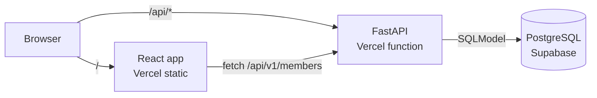
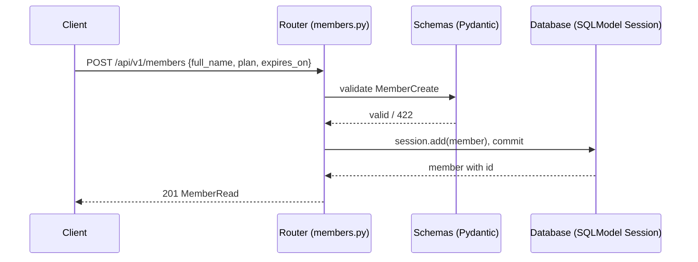
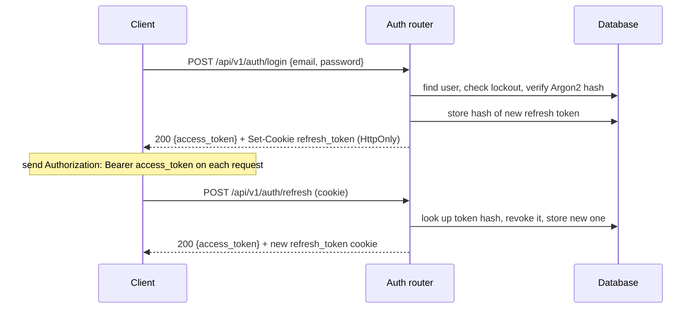
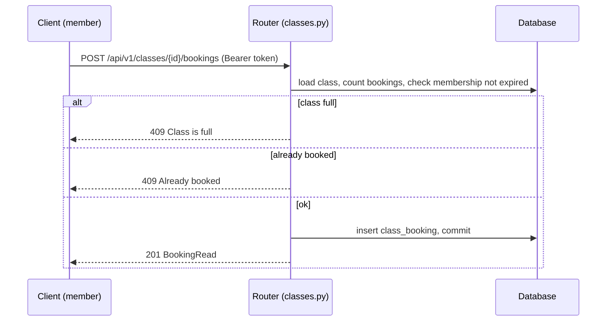
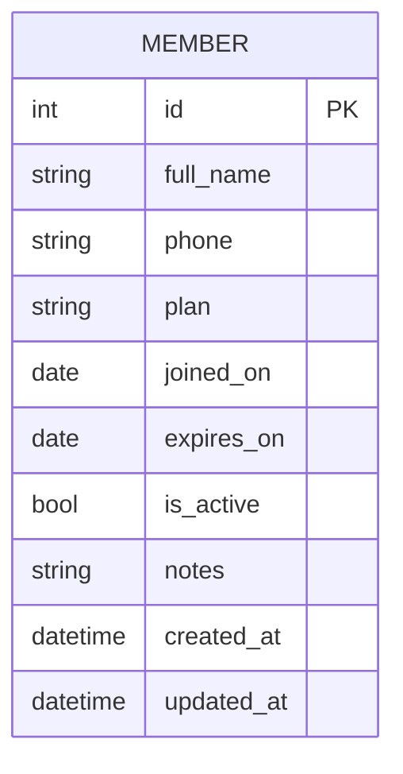
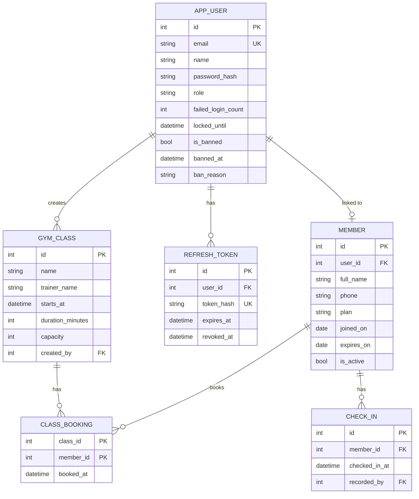
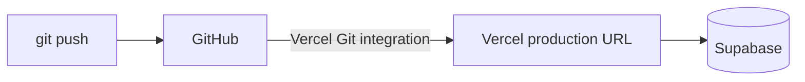

# Technical Design Document (TDD) — Gym Buddy

| Field | Value |
|---|---|
| Product | Gym Buddy |
| Version | MVP + Beta |
| Releases | MVP — Mid-term, Beta — Final |
| Status | Draft |
| Related docs | [Product Requirements Document (PRD)](01-prd.md), [Software Requirements Specification (SRS)](02-srs.md) |

Sections and tables are marked **MVP** or **Beta**. Build the MVP parts for the mid-term; the Beta parts extend them for the final.

**Documents in this set**

| Short form | Full form | Purpose | File |
|---|---|---|---|
| PRD | Product Requirements Document | What we build and why | [01-prd.md](01-prd.md) |
| SRS | Software Requirements Specification | Exact requirements, permissions and acceptance criteria | [02-srs.md](02-srs.md) |
| TDD | Technical Design Document | How we build it: architecture, data model, API (this document) | [03-tdd.md](03-tdd.md) |

## 1. Overview

- **MVP:** a FastAPI REST API for gym member CRUD (name, phone, membership plan, start and expiry dates), stored in a SQL database through SQLModel, deployed together with the Vite + React frontend as one Vercel project.
- **Beta:** the same app gains user accounts and login (JWT), global roles (`member`/`admin`), workout classes with member bookings and capacity limits, attendance check-ins, an admin dashboard, and security hardening. Schema changes are managed with Alembic.

## 2. Tech stack

| Layer | Choice | Why | Release |
|---|---|---|---|
| API | FastAPI | Validation, OpenAPI docs and type hints out of the box; already in the repo template | MVP |
| ORM / models | SQLModel | One class works as both the Pydantic schema and the database table; made by the FastAPI author | MVP |
| Database (production) | PostgreSQL on Supabase | Free tier, managed Postgres with a web dashboard (table editor, SQL editor), built-in connection pooler for serverless | MVP |
| DB driver | `psycopg[binary]` (psycopg 3) | Standard Postgres driver for SQLAlchemy/SQLModel | MVP |
| Database (local) | SQLite | No setup needed | MVP |
| Frontend | Vite + React + TypeScript | Already in the repo template | MVP |
| Hosting | Vercel | Frontend and backend in one project (`vercel.json`), auto deploy from GitHub | MVP |
| Migrations | Alembic | Versioned schema changes as the model grows from 1 to 6 tables | Beta |
| JWT | PyJWT | Sign and verify access tokens | Beta |
| Password hashing | `pwdlib[argon2]` | Argon2 hashing, recommended in the FastAPI docs | Beta |

## 3. Architecture



`vercel.json` already routes `/api/*` to the backend service and everything else to the frontend, so every backend route must start with `/api`. For the same reason the API docs are served at `/api/docs` (not FastAPI's default `/docs`):

```python
app = FastAPI(title="Gym Buddy API", docs_url="/api/docs", openapi_url="/api/openapi.json", redoc_url=None)
```

### 3.1 Request flow — MVP



### 3.2 Login and refresh flow — Beta



### 3.3 Class booking flow — Beta



## 4. Project structure

```
backend/
  main.py              # creates the app, includes routers, health check
  app/
    __init__.py
    config.py          # (Beta) settings from env vars: JWT secret, token lifetimes
    database.py        # engine, get_session()
    models.py          # tables + Create / Update / Read schemas
    security.py        # (Beta) password hashing, JWT create/verify, refresh tokens
    deps.py            # (Beta) get_current_user, require_admin, get_own_member, get_class_or_404
    routers/
      __init__.py
      members.py       # /api/v1/members (+ check-ins in Beta)
      auth.py          # (Beta) /api/v1/auth/*
      users.py         # (Beta) /api/v1/users/me (profile, change name, change password)
      admin.py         # (Beta) /api/v1/admin/*
      classes.py       # (Beta) /api/v1/classes/* (classes and bookings)
  alembic/             # (Beta) migration scripts
  alembic.ini          # (Beta)
  requirements.txt
frontend/
  src/
    App.tsx            # (Could) simple member list using the API
    pages/             # (Beta, Could) Login, Signup, MyMembership, Classes, Profile, AdminDashboard
docs/
  01-prd.md
  02-srs.md
  03-tdd.md
```

Keep routers thin: validate input, check permissions through dependencies, then read/write with the session. A separate service layer is not needed at this size.

## 5. Data model

### 5.1 `member` table — MVP

| Column | Type | Rules |
|---|---|---|
| `id` | integer | Primary key, auto increment |
| `full_name` | varchar(100) | Not null |
| `phone` | varchar(20) | Nullable |
| `plan` | varchar(10) | `monthly`, `quarterly` or `yearly`, not null |
| `joined_on` | date | Not null, defaults to today |
| `expires_on` | date | Not null, must be on or after `joined_on` |
| `is_active` | boolean | Not null, default `true` (set to `false` to freeze a membership) |
| `notes` | varchar(500) | Nullable |
| `created_at` | timestamp (UTC) | Not null, set on insert |
| `updated_at` | timestamp (UTC) | Not null, set on insert and every update |



### 5.2 Full data model — Beta

`user` is a reserved word in PostgreSQL, so the table is named `app_user`. Classes are stored in `gym_class` because `class` is reserved in Python.

**`app_user`**

| Column | Type | Rules |
|---|---|---|
| `id` | integer | Primary key |
| `email` | varchar(254) | Unique, stored lowercase |
| `name` | varchar(100) | Not null |
| `password_hash` | varchar | Argon2 hash, never returned by the API |
| `role` | varchar(10) | `member` or `admin`, default `member` |
| `failed_login_count` | integer | Default 0 |
| `locked_until` | timestamp (UTC) | Nullable |
| `is_banned` | boolean | Default `false` |
| `banned_at` | timestamp (UTC) | Nullable |
| `ban_reason` | varchar(500) | Nullable |
| `created_at`, `updated_at` | timestamp (UTC) | Not null |

**`refresh_token`**

| Column | Type | Rules |
|---|---|---|
| `id` | integer | Primary key |
| `user_id` | integer | FK → `app_user.id`, on delete cascade |
| `token_hash` | char(64) | SHA-256 of the token, unique |
| `expires_at` | timestamp (UTC) | Not null (now + 7 days) |
| `revoked_at` | timestamp (UTC) | Nullable |
| `created_at` | timestamp (UTC) | Not null |

**`member` (new column in Beta)**

| Column | Type | Rules |
|---|---|---|
| `user_id` | integer | FK → `app_user.id`, nullable, unique, on delete set null. Links a membership record to a login account. `null` = walk-in member without an account |

**`gym_class`**

| Column | Type | Rules |
|---|---|---|
| `id` | integer | Primary key |
| `name` | varchar(100) | Not null |
| `description` | varchar(500) | Nullable |
| `trainer_name` | varchar(100) | Nullable |
| `starts_at` | timestamp (UTC) | Not null |
| `duration_minutes` | integer | Not null, 15–240 |
| `capacity` | integer | Not null, 1–200 |
| `created_by` | integer | FK → `app_user.id` |
| `created_at`, `updated_at` | timestamp (UTC) | Not null |

**`class_booking`**

| Column | Type | Rules |
|---|---|---|
| `class_id` | integer | PK part, FK → `gym_class.id`, on delete cascade |
| `member_id` | integer | PK part, FK → `member.id`, on delete cascade |
| `booked_at` | timestamp (UTC) | Not null |

**`check_in`**

| Column | Type | Rules |
|---|---|---|
| `id` | integer | Primary key |
| `member_id` | integer | FK → `member.id`, on delete cascade |
| `checked_in_at` | timestamp (UTC) | Not null |
| `recorded_by` | integer | FK → `app_user.id`: the admin who recorded it |

Indexes: `member(user_id)`, `class_booking(member_id)`, `check_in(member_id, checked_in_at)`, `gym_class(starts_at)`, `refresh_token(user_id)`.



**Who can see a member record:**
- A member (`role = member`): only the record where `member.user_id` is their own id.
- An admin: every member record.

**A membership is "valid"** when `is_active` is true and `expires_on >= today`. Booking a class and checking in both require a valid membership.

### 5.3 Schemas

| Schema | Used for | Fields | Release |
|---|---|---|---|
| `MemberCreate` | `POST` member body | `full_name`, `phone?`, `plan`, `joined_on?`, `expires_on`, `notes?` | MVP |
| `MemberUpdate` | `PATCH` member body | all optional: `full_name`, `phone`, `plan`, `expires_on`, `is_active`, `notes` | MVP |
| `MemberRead` | Member responses | all member columns (+ `user_id` in Beta) | MVP |
| `SignupRequest` | Sign up | `email`, `name`, `password` | Beta |
| `LoginRequest` | Log in | `email`, `password` | Beta |
| `TokenResponse` | Login / refresh | `access_token`, `token_type: "bearer"`, `expires_in` | Beta |
| `UserRead` | User responses | `id`, `email`, `name`, `role`, `created_at` (never `password_hash`) | Beta |
| `RoleUpdate` | Change role | `role` | Beta |
| `ProfileUpdate` | Change own name | `name` | Beta |
| `PasswordChange` | Change own password | `current_password`, `new_password` | Beta |
| `AdminUserRead` | Admin user list | `UserRead` + `is_banned`, `banned_at`, `ban_reason` | Beta |
| `BanRequest` | Ban a user | `reason?` | Beta |
| `AdminStats` | Dashboard | `members {total, active, expired, new_last_7_days}`, `classes {total, upcoming}`, `check_ins {today, last_7_days}`, `users {total, admins, banned}` | Beta |
| `ClassCreate` / `ClassUpdate` | Create / edit class | `name`, `description?`, `trainer_name?`, `starts_at`, `duration_minutes`, `capacity` (all optional on update) | Beta |
| `ClassRead` | Class responses | all class columns + `booked_count`, `is_booked_by_me` | Beta |
| `BookingRead` | Booking responses | `class_id`, `member_id`, `member_name`, `booked_at` | Beta |
| `CheckInRead` | Check-in responses | `id`, `member_id`, `checked_in_at` | Beta |

MVP sketch:

```python
class MemberBase(SQLModel):
    full_name: str = Field(min_length=1, max_length=100)
    phone: str | None = Field(default=None, max_length=20)
    plan: str = Field(regex="^(monthly|quarterly|yearly)$")
    expires_on: date
    notes: str | None = Field(default=None, max_length=500)

class Member(MemberBase, table=True):
    id: int | None = Field(default=None, primary_key=True)
    joined_on: date = Field(default_factory=date.today)
    is_active: bool = True
    created_at: datetime = Field(default_factory=lambda: datetime.now(timezone.utc))
    updated_at: datetime = Field(default_factory=lambda: datetime.now(timezone.utc))

class MemberCreate(MemberBase):
    joined_on: date | None = None

class MemberUpdate(SQLModel):
    full_name: str | None = Field(default=None, min_length=1, max_length=100)
    phone: str | None = Field(default=None, max_length=20)
    plan: str | None = Field(default=None, regex="^(monthly|quarterly|yearly)$")
    expires_on: date | None = None
    is_active: bool | None = None
    notes: str | None = Field(default=None, max_length=500)

class MemberRead(MemberBase):
    id: int
    joined_on: date
    is_active: bool
    created_at: datetime
    updated_at: datetime
```

`full_name` is trimmed before validation so `"   "` is rejected. `expires_on` before `joined_on` returns `422`.

## 6. REST API design

Base path: `/api/v1`. All bodies are JSON.

### 6.1 Endpoints — MVP

In the MVP no login is needed. In the Beta the member endpoints become admin-only (members use `/users/me/membership` instead).

| Method | Path | Body | Success | Errors | FR |
|---|---|---|---|---|---|
| `POST` | `/api/v1/members` | `MemberCreate` | `201` `MemberRead` | `422` | FR-01, FR-07 |
| `GET` | `/api/v1/members?offset=0&limit=20&status=` | — | `200` `MemberRead[]` | `422` | FR-02, FR-03 |
| `GET` | `/api/v1/members/{id}` | — | `200` `MemberRead` | `404` | FR-04 |
| `PATCH` | `/api/v1/members/{id}` | `MemberUpdate` | `200` `MemberRead` | `404`, `422` | FR-05, FR-07 |
| `DELETE` | `/api/v1/members/{id}` | — | `204` | `404` | FR-06 |
| `GET` | `/api/health` | — | `200` `{"status":"ok"}` | — | FR-10 |

`status` is an optional filter: `active` (valid membership), `expired` (`expires_on < today`) or `frozen` (`is_active = false`).

### 6.2 Endpoints — Beta

"Who" uses the roles from the [SRS permission matrix (section 3.9)](02-srs.md#39-permission-matrix--beta). Every endpoint except auth, health and docs needs `Authorization: Bearer <access_token>` (`401` without it).

**Auth and profile**

| Method | Path | Who | Body | Success | Errors | FR |
|---|---|---|---|---|---|---|
| `POST` | `/api/v1/auth/signup` | Guest | `SignupRequest` | `201` `UserRead` | `409`, `422` | FR-12 |
| `POST` | `/api/v1/auth/login` | Guest | `LoginRequest` | `200` `TokenResponse` + cookie | `401`, `429` | FR-13, FR-34 |
| `POST` | `/api/v1/auth/refresh` | Refresh cookie | — | `200` `TokenResponse` + new cookie | `401` | FR-14 |
| `POST` | `/api/v1/auth/logout` | Refresh cookie | — | `204`, cookie cleared | — | FR-15 |
| `GET` | `/api/v1/users/me` | Member | — | `200` `UserRead` | `401` | FR-16 |
| `PATCH` | `/api/v1/users/me` | Member | `ProfileUpdate` | `200` `UserRead` | `422` | FR-40 |
| `POST` | `/api/v1/users/me/password` | Member | `PasswordChange` | `204` (all sessions logged out) | `400` (wrong current password), `422` | FR-41 |
| `GET` | `/api/v1/users/me/membership` | Member | — | `200` `MemberRead` | `404` (no membership linked) | FR-17 |
| `GET` | `/api/v1/users/me/check-ins?offset&limit` | Member | — | `200` `CheckInRead[]` | `404` | FR-18 |

**Members (admin management)** — same five endpoints as the MVP, now admin-only (`403` for non-admins).

| Method | Path | Who | Body | Success | Errors | FR |
|---|---|---|---|---|---|---|
| `POST` | `/api/v1/members` | Admin | `MemberCreate` (+ optional `user_id`) | `201` `MemberRead` | `403`, `409` (user already linked), `422` | FR-19 |
| `GET` | `/api/v1/members?offset&limit&status` | Admin | — | `200` `MemberRead[]` | `403` | FR-19 |
| `GET` | `/api/v1/members/{id}` | Admin | — | `200` `MemberRead` | `403`, `404` | FR-19 |
| `PATCH` | `/api/v1/members/{id}` | Admin | `MemberUpdate` | `200` `MemberRead` | `403`, `404`, `422` | FR-19 |
| `DELETE` | `/api/v1/members/{id}` | Admin | — | `204` | `403`, `404` | FR-19 |
| `POST` | `/api/v1/members/{id}/check-ins` | Admin | — | `201` `CheckInRead` | `400` (membership not valid), `403`, `404` | FR-30 |
| `GET` | `/api/v1/members/{id}/check-ins?offset&limit` | Admin | — | `200` `CheckInRead[]` | `403`, `404` | FR-31 |

**Admin**

| Method | Path | Who | Body | Success | Errors | FR |
|---|---|---|---|---|---|---|
| `GET` | `/api/v1/admin/users?offset&limit` | Admin | — | `200` `AdminUserRead[]` | `403` | FR-21 |
| `PATCH` | `/api/v1/admin/users/{user_id}/role` | Admin | `RoleUpdate` | `200` `UserRead` | `400` (own role), `403`, `404` | FR-22 |
| `GET` | `/api/v1/admin/stats` | Admin | — | `200` `AdminStats` | `403` | FR-35 |
| `POST` | `/api/v1/admin/users/{user_id}/ban` | Admin | `BanRequest` | `200` `AdminUserRead` | `400` (self / other admin), `403`, `404` | FR-36 |
| `POST` | `/api/v1/admin/users/{user_id}/unban` | Admin | — | `200` `AdminUserRead` | `403`, `404` | FR-38 |

`GET /api/v1/admin/users` returns `AdminUserRead[]` so the dashboard can show who is banned (FR-39).

**Classes and bookings**

| Method | Path | Who | Body | Success | Errors | FR |
|---|---|---|---|---|---|---|
| `POST` | `/api/v1/classes` | Admin | `ClassCreate` | `201` `ClassRead` | `403`, `422` | FR-25 |
| `GET` | `/api/v1/classes?offset&limit&upcoming=true` | Member | — | `200` `ClassRead[]` | — | FR-26 |
| `GET` | `/api/v1/classes/{class_id}` | Member | — | `200` `ClassRead` | `404` | FR-26 |
| `PATCH` | `/api/v1/classes/{class_id}` | Admin | `ClassUpdate` | `200` `ClassRead` | `403`, `404`, `422` (capacity below current bookings) | FR-27 |
| `DELETE` | `/api/v1/classes/{class_id}` | Admin | — | `204` | `403`, `404` | FR-27 |
| `GET` | `/api/v1/classes/{class_id}/bookings` | Admin | — | `200` `BookingRead[]` | `403`, `404` | FR-28 |
| `POST` | `/api/v1/classes/{class_id}/bookings` | Member | — | `201` `BookingRead` | `400` (membership not valid / class already started), `404`, `409` (full or already booked) | FR-28, FR-29 |
| `DELETE` | `/api/v1/classes/{class_id}/bookings` | Member | — | `204` (cancel my booking) | `404` | FR-29 |

### 6.3 Examples

Create:

```http
POST /api/v1/members
Content-Type: application/json

{ "full_name": "Rafi Ahmed", "phone": "01700000000", "plan": "monthly", "expires_on": "2026-11-10" }
```

```http
201 Created

{
  "id": 1,
  "full_name": "Rafi Ahmed",
  "phone": "01700000000",
  "plan": "monthly",
  "joined_on": "2026-10-10",
  "expires_on": "2026-11-10",
  "is_active": true,
  "notes": null,
  "created_at": "2026-10-10T10:00:00Z",
  "updated_at": "2026-10-10T10:00:00Z"
}
```

Renew a membership:

```http
PATCH /api/v1/members/1
Content-Type: application/json

{ "expires_on": "2026-12-10" }
```

Log in (Beta):

```http
POST /api/v1/auth/login
Content-Type: application/json

{ "email": "a@x.com", "password": "correct horse battery" }
```

```http
200 OK
Set-Cookie: refresh_token=...; HttpOnly; Secure; SameSite=Strict; Path=/api/v1/auth; Max-Age=604800

{ "access_token": "eyJhbGciOi...", "token_type": "bearer", "expires_in": 900 }
```

### 6.4 Error format

Use FastAPI's default format so there is no custom code to maintain:

```json
{ "detail": "Member not found" }
```

Validation errors (`422`) use FastAPI's built-in list format, which names the failing field:

```json
{ "detail": [ { "loc": ["body", "full_name"], "msg": "String should have at least 1 character", "type": "string_too_short" } ] }
```

A catch-all exception handler returns `500` with `{"detail": "Internal server error"}` and logs the real error (NFR-07).

### 6.5 Design rules
- Plural nouns for resources (`/members`, `/classes`, `/bookings`, `/check-ins`), no verbs in paths (except the `auth` actions and `ban`/`unban`).
- Nested paths show ownership: a class's bookings live under `/classes/{class_id}/bookings`; a member's check-ins under `/members/{id}/check-ins`.
- `PATCH` for partial update; only fields sent are changed (`model_dump(exclude_unset=True)`).
- Lists are ordered by `created_at` descending (classes by `starts_at` ascending) and take `offset` / `limit`.
- `404` (not `403`) when the caller is not allowed to know a resource exists; `403` when they can see it but not do the action.
- `/api/v1` prefix so a future `v2` of the API can live next to it.

## 7. Database access

- `database.py` creates one engine from the `DATABASE_URL` env var, defaulting to `sqlite:///./gym_buddy.db` locally.
- `get_session()` is a FastAPI dependency that yields a `Session` per request.
- MVP: tables are created on startup with `SQLModel.metadata.create_all(engine)`.
- Beta: `create_all` is removed and the schema is managed by Alembic (section 12).
- On Vercel, connect through Supabase's **transaction pooler** (Supavisor, port `6543`), because each serverless function opens its own connections.
- The transaction pooler does not support prepared statements, so the engine is created with `poolclass=NullPool` (the pooler does the pooling) and `connect_args={"prepare_threshold": None}` for psycopg.
- URL format: `postgresql+psycopg://postgres.<project-ref>:<password>@aws-0-<region>.pooler.supabase.com:6543/postgres`.
- Only the Postgres database is used. Supabase Auth, Storage and the auto-generated REST API are not used; login is our own (section 10) and all access goes through our FastAPI backend.
- Row Level Security (RLS) is not used because the browser never talks to Supabase directly; permissions are enforced in FastAPI. Keep the Supabase `anon` and `service_role` keys out of the frontend.

## 8. Configuration

| Variable | Local | Vercel | Release |
|---|---|---|---|
| `DATABASE_URL` | not set (SQLite default) | Supabase transaction pooler URL (port `6543`) | MVP |
| `JWT_SECRET` | any long random string in `.env` | Random 32+ byte secret (`python -c "import secrets; print(secrets.token_urlsafe(48))"`) | Beta |
| `ACCESS_TOKEN_MINUTES` | `15` | `15` | Beta |
| `REFRESH_TOKEN_DAYS` | `7` | `7` | Beta |
| `MIGRATION_DATABASE_URL` | not needed | Not on Vercel. Used only on a developer machine to run Alembic against Supabase (session pooler, port `5432`) | Beta |

No secrets are committed. `.env` stays in `.gitignore`.

Supabase setup (one time):
1. Create a project at supabase.com and save the database password.
2. **Connect** -> **Transaction pooler** -> copy the URI, and change the scheme to `postgresql+psycopg://`.
3. In Vercel -> Project -> **Settings** -> **Environment Variables**, add it as `DATABASE_URL`.
4. Add `psycopg[binary]` to `backend/requirements.txt`.

Free-tier Supabase projects pause after a week with no activity; open the dashboard and restore the project before a demo if needed.

## 9. Deployment



- The repo is connected to Vercel through the Vercel GitHub integration (already set up by the template); a push to `main` deploys to production.
- Environment variables from section 8 are set in the Vercel project settings.
- (Beta) Before merging a change that includes a new migration, run `alembic upgrade head` against Supabase (section 12), then merge so Vercel deploys the matching code.

## 10. Auth and RBAC design — Beta

### 10.1 Tokens

| Token | Format | Lifetime | Where it lives |
|---|---|---|---|
| Access token | JWT, HS256, claims `sub` (user id), `role`, `iat`, `exp` | 15 min | Frontend memory; sent as `Authorization: Bearer` |
| Refresh token | Random 32 bytes (`secrets.token_urlsafe`) | 7 days | `refresh_token` cookie (`HttpOnly`, `Secure`, `SameSite=Strict`, `Path=/api/v1/auth`); DB keeps only its SHA-256 hash |

- **Refresh rotation:** each refresh revokes the old token and issues a new one. If a revoked token is used again, all of that user's refresh tokens are revoked (it was probably stolen).
- **Logout:** revokes the current refresh token and clears the cookie. The access token simply expires within 15 minutes.
- The `role` claim is only informational; permission checks always use the role loaded from the database, so a role change applies on the next request.

### 10.2 Passwords and login lockout

- Hash with `pwdlib` (Argon2). Verify on login; never log or return the hash.
- Unknown email and wrong password both return `401 "Invalid email or password"`, so emails cannot be discovered.
- Wrong password: `failed_login_count += 1`. At 5, set `locked_until = now + 15 min` and reset the count. While `locked_until > now`, login returns `429`. A successful login resets the count.
- Stored in the database (not in memory) because serverless functions do not share memory.

### 10.3 Permission dependencies

Permissions are FastAPI dependencies, so each route declares what it needs:

```python
bearer = HTTPBearer()

def get_current_user(creds=Depends(bearer), session: Session = Depends(get_session)) -> AppUser:
    payload = decode_access_token(creds.credentials)   # 401 if invalid or expired
    user = session.get(AppUser, int(payload["sub"]))
    if user is None:
        raise HTTPException(401, "Invalid token")
    if user.is_banned:
        raise HTTPException(403, "Account banned")   # checked on every request, not only at login
    return user

def require_admin(user: AppUser = Depends(get_current_user)) -> AppUser:
    if user.role != "admin":
        raise HTTPException(403, "Admin only")
    return user

def get_own_member(user: AppUser = Depends(get_current_user), session: Session = Depends(get_session)) -> Member:
    member = session.exec(select(Member).where(Member.user_id == user.id)).first()
    if member is None:
        raise HTTPException(404, "No membership linked to this account")
    return member

def require_valid_membership(member: Member = Depends(get_own_member)) -> Member:
    if not member.is_active or member.expires_on < date.today():
        raise HTTPException(400, "Membership is not valid")
    return member
```

| Route group | Dependency |
|---|---|
| `/api/v1/users/me/*`, `GET /api/v1/classes`, `GET /api/v1/classes/{id}` | `get_current_user` |
| `/api/v1/users/me/membership`, `/api/v1/users/me/check-ins` | `get_own_member` |
| `/api/v1/members/*`, `/api/v1/admin/*`, `POST/PATCH/DELETE /classes`, `GET /classes/{id}/bookings` | `require_admin` |
| `POST/DELETE /classes/{id}/bookings` | `require_valid_membership` (cancel uses `get_own_member`) |

Row-level rules that depend on the data are checked inside the route:
- Own membership: query with `Member.user_id == user.id`; a member can never pass an id to read another member's record.
- Book class: class must exist (`404`), `starts_at` must be in the future (`400`), `count(bookings) < capacity` (`409` if full), and no existing `(class_id, member_id)` row (`409`). Do the capacity check and insert in one transaction.
- Cancel booking: delete the caller's own `(class_id, member_id)` row; none found → `404`.
- Edit class capacity: new `capacity` below the current booking count → `422`.
- Check-in: member must be valid (`400` otherwise); a second check-in for the same member on the same UTC date is allowed but the dashboard counts distinct members.
- Link account: `user_id` on a member must reference an existing user not already linked to another member, otherwise `409`.
- Change role: `user_id == caller` → `400`.
- Ban: target is the caller or an admin → `400`. Otherwise set `is_banned = true`, `banned_at = now`, `ban_reason`, and revoke all the user's refresh tokens in the same transaction. Unban clears the three fields.
- Login and refresh also reject banned users with `403`.
- Change password: verify `current_password` (`400` if wrong), hash `new_password`, revoke all the user's refresh tokens; the client then logs in again.

### 10.4 Admin dashboard stats

One endpoint, plain `COUNT` queries (no extra tables):

```python
now = datetime.now(timezone.utc)
today = date.today()
week_ago = now - timedelta(days=7)
stats = AdminStats(
    members={
        "total": count(Member),
        "active": count(Member, Member.is_active, Member.expires_on >= today),
        "expired": count(Member, Member.expires_on < today),
        "new_last_7_days": count(Member, Member.created_at >= week_ago),
    },
    classes={
        "total": count(GymClass),
        "upcoming": count(GymClass, GymClass.starts_at >= now),
    },
    check_ins={
        "today": count(CheckIn, CheckIn.checked_in_at >= start_of_today_utc),
        "last_7_days": count(CheckIn, CheckIn.checked_in_at >= week_ago),
    },
    users={
        "total": count(AppUser),
        "admins": count(AppUser, AppUser.role == "admin"),
        "banned": count(AppUser, AppUser.is_banned),
    },
)
```

`count(model, *filters)` is a small helper around `select(func.count()).select_from(model).where(*filters)`.

## 11. Security — Beta

| Area | Design |
|---|---|
| Passwords | Argon2 via `pwdlib`, minimum 8 characters |
| Tokens | Section 10.1; `JWT_SECRET` only in env vars |
| Cookies | `HttpOnly`, `Secure`, `SameSite=Strict`, path-limited |
| CORS | Not enabled: frontend and API share the Vercel origin; locally Vite proxies `/api` |
| Security headers | Added for all routes in `vercel.json` (below) |
| Brute force | Login lockout (section 10.2) |
| Injection | SQLModel/SQLAlchemy parameterised queries only |
| Errors | Catch-all handler returns a generic `500`; details only in logs |
| Data exposure | Response schemas (`UserRead`, `MemberRead`) list fields explicitly; `password_hash` and token hashes are never in a response schema. Member phone numbers and notes are returned only to admins and the member themself |

```json
"headers": [
  {
    "source": "/(.*)",
    "headers": [
      { "key": "X-Content-Type-Options", "value": "nosniff" },
      { "key": "X-Frame-Options", "value": "DENY" },
      { "key": "Referrer-Policy", "value": "strict-origin-when-cross-origin" },
      { "key": "Strict-Transport-Security", "value": "max-age=63072000; includeSubDomains" }
    ]
  }
]
```

## 12. Migrations — Beta

- Add Alembic in `backend/alembic/`, with `target_metadata = SQLModel.metadata`.
- Revision `0001_mvp`: the MVP `member` table. On the existing Supabase database (created by `create_all`), run `alembic stamp 0001_mvp` once instead of upgrading.
- Revision `0002_beta`: create `app_user` (including lockout and ban columns), `refresh_token`, `gym_class`, `class_booking`, `check_in`; add nullable unique `user_id` and its index to `member` (existing MVP members stay as walk-in members, so no data is deleted).
- Run migrations from a developer machine: `MIGRATION_DATABASE_URL=... alembic upgrade head` (Supabase session pooler, port `5432`), then merge the code.
- After `0002_beta`, remove `create_all` from startup.
- Promote the first admin in the Supabase table editor: set `role = 'admin'` on your `app_user` row.

## 13. Risks

| Risk | Mitigation |
|---|---|
| Serverless cold starts make the first request slow | Acceptable; measure NFR-01 excluding cold start |
| Too many DB connections from serverless functions | Use Supabase transaction pooler (port `6543`) with `NullPool` |
| Free-tier project pauses when idle | Check the Supabase dashboard before demos; any API activity keeps it awake |
| Code deployed before its migration ran (or the reverse) | Always run `alembic upgrade head` before merging a migration; keep migrations additive where possible |
| JWT secret leaked | Only in Vercel env vars; rotating it logs everyone out (acceptable) |
| Permission bug exposes another member's data | All permission checks go through the dependencies in section 10.3; review every new route against the [SRS permission matrix](02-srs.md#39-permission-matrix--beta) |
| Two members book the last class spot at the same time | Capacity check and insert run in one transaction; the composite primary key blocks duplicate bookings |
| Expiry compared against the wrong date (time zones) | Store `expires_on` as a plain date; compare with the server's `date.today()` in UTC and state this in the SRS |
| No automated tests or CI yet | Review each PR manually against the [SRS acceptance criteria](02-srs.md#5-acceptance-criteria); tests and CI are planned after this semester's scope |